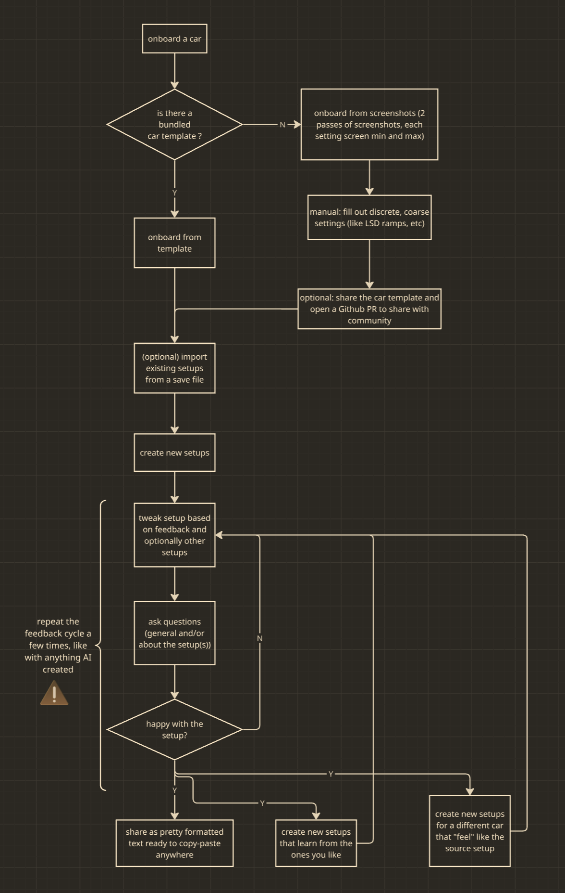

# Car Setups — your personal AI rally setup engineer for Assetto Corsa Rally

A free Claude **Skill** that crafts **personalized** car setups for **Assetto Corsa Rally** —
tuned to *your* driving style and preferences — and saves them to **your Notion**, so you can
read them on your phone while you play. It's not a one-off generator but a **complete system for
the whole life of a setup**: onboard a car, build a setup, tweak it on feedback, review it,
share it, and import what you already have. You can also ask questions about general setup engineering. The skill was built for ACR but the approach is general.

> **Video walkthrough:** *(coming soon — YouTube link will go here)*

**What it does**
1. **Onboards a car** — take two sets of car param screenshots (everything at min, then max) and it
   maps every knob and slider in seconds. Already in the bundled library? One command and you're
   done — no screenshots needed.
2. **Builds a setup for any stage** — describe the stage (or skip it for an arbitrary build) and
   how you like the car to feel; it writes a setup constrained to what the car actually allows,
   with the full reasoning behind every choice saved to your Notion so you can read it on your
   phone while you play. Stages are saved once to a reusable catalogue, so the same stage backs
   any number of setups across any cars without re-describing it each time.
3. **Tweaks on your feedback** — describe what felt wrong after a run and it targets exactly the
   right parameters and proposes a minimal set of changes, right in the chat. Refine as many times
   as you like; when you're happy, ask it to save and it writes a new setup row — the original is
   never touched.
4. **Reviews any setup** — checks every value against legal ranges and your guidelines, flags
   anything misaligned, and appends a timestamped AI Review to the setup's Notion page.
5. **Your setup engineer, on demand** — just ask. Why is the front ARB stiffer on this setup?
   What does preload actually do? How should I think about spring vs damper rates? It pulls your
   setups from Notion when you ask about one, compares two when you ask, and explains from the
   same tuning knowledge it builds with. Anything setup-related goes. Read-only: nothing changes.
6. **Shares a setup** — one command and you get a clean, copy-paste-ready block ready to drop
   into Discord, WhatsApp, or anywhere you'd like.
7. **Imports what you already have** — attach your ACR save file and it pulls your existing
   setups straight into Notion, so you don't need to enter them manually. You can also import
   only selected setups of certain cars, it's not all-or-nothing.
8. **Exports a car template** — once you've onboarded a car from screenshots, package it as a
   YAML file and share it with the community in one click. No command line, no tokens — just a
   free GitHub account and a green button.

Together these cover the **whole lifecycle of a setup** in one place. Every value stays within
what the car actually allows, and the setups get **more personal the more you use it** — rate
your setups and tick "Learn from this" on the good ones, and future setups follow your taste.



**Other games:** this skill was built and tested exclusively for **Assetto Corsa Rally**. You
may be able to onboard cars and build setups for other rally/racing games, but this has not been
tested and is not supported. Use it for other games entirely at your own risk — no support will
be provided for non-ACR use. **Save-file import is ACR-only.**

---

## Before you start (prerequisites)

- A **Claude account** at [claude.ai](https://claude.ai). Works on the **Free** plan; for heavy
  use the **Pro** plan is smoother. *(The Skill is free — running Claude a lot may not be.)*
- A **Notion account** (free is fine). All your setups live here.

## Setup (one time, ~5 minutes)

1. **Connect Notion.** In claude.ai → **Settings → Connectors**, add **Notion** and authorize
   it. (One click; available on every plan.)
2. **Turn on code execution + Skills + network.** Settings → **Capabilities** → enable **Code
   execution** and **Skills**. Then under **Network egress** set the domain allowlist to **All
   domains** — the skill needs this to call Notion's API from the code sandbox.
3. **Add the skill.** Download **`car-setups-skill.zip`** from this project's
   [Releases](../../releases). In claude.ai → Settings → **Customize → Skills → Create skill**,
   upload the ZIP.
4. **Onboard your first car.** Start a new chat and say *"Onboard the [car name] for Assetto
   Corsa Rally."* — see [Quick start](#quick-start) for details. This creates your Notion
   structure (the Car setups page and its tables).
5. **Give the skill read access to Notion** *(takes ~3 minutes).* The skill reads your tables
   through Notion's **API** so every read is fast, exact, and cheap.

   1. **Create a read-only integration.** Go to
      [notion.so/my-integrations](https://www.notion.so/my-integrations) → **New integration** →
      **Internal**, in your workspace. Under **Capabilities**, leave **only "Read content"**
      checked (uncheck Update and Insert). Copy the **Internal Integration Secret**
      (`secret_…` / `ntn_…`).
   2. **Connect it to only your data.** Open your **Car setups** page in Notion → **•••** →
      **Connections** → add your integration. Access cascades to everything under it (your
      Parameters/Setups) — **and nothing else** in your workspace. The token is read-only and
      can't see anything you didn't connect.
   3. **Give the skill the token** (pick one):
      - **Store it (recommended):** make a page named **`Config`** under **Car setups** and
        paste the token onto it. The skill reads it automatically — set once, works in every
        chat. (It's safe here: the token is read-only and only unlocks the data it sits next
        to.)
      - **Paste per chat:** don't store it; paste it when the skill asks. Nothing is saved.

   The skill detects the token and reads your setups in one exact call.

## Quick start

**Onboard your first car**

Say: *"Onboard the Lancia Stratos HF for Assetto Corsa Rally."*

- If the car has a **bundled template**, Claude will offer to auto-populate Notion from it —
  no screenshots needed.
- Otherwise, take two sets of screenshots of the car's Setup screens in ACR (everything at minimum,
  then everything at maximum), attach them, and Claude reads every setting's range from the
  images. **Take this first set on a tarmac stage (e.g. Alsace)** — that's the baseline (see
  *Settings that change on gravel* below).

Either way, your Notion structure is created automatically on first use. Claude also looks up the
car's **engine layout, weight bias, and approximate weight** (facts the game doesn't show) to
personalize how it balances setups — you can edit any of these on the car's Notion page.

**Settings that change on gravel.** On many cars, a few suspension settings (most often spring
stiffness) have a *different* available range on gravel than on tarmac. So after the tarmac pass,
Claude asks you to do a quick check: load a **gravel stage (e.g. Wales)**, open the **Suspensions**
screen, and see whether the range differs. If it does, you take a **second full two-pass set of
screenshots on gravel** (everything at minimum, then everything at maximum — same as the first
time), and Claude compares the two and records the gravel-only ranges separately — then every
setup is checked against the range that's actually legal for the stage you're driving. If nothing
differs (or you'd rather skip it), the tarmac ranges are used everywhere — nothing else to do.

**Build a setup**

Tell Claude the car, the stage (optional — leave it out for an arbitrary setup, e.g. "a drift
setup on tarmac"), and how you like to drive — e.g.:
*"Build a setup for the Lancia Stratos on a fast, bumpy tarmac stage; I like gentle
throttle-on rotation and hate a floaty car under braking."*
The first time you mention a stage, Claude saves its facts (surface, length, key corners) once to
a shared catalogue in Notion — any later setup, for any car, can reference the same stage without
re-describing it.

The new setup row appears in your Notion `Setups` database. Open it on your phone to see the
values and the reasoning behind each choice. After driving: set a **Rating**, add **Notes**,
and tick **Learn from this** if you liked it — future setups learn from the ones you've checked.

**Tweak a setup**

After driving, describe what felt wrong — e.g.: *"The Alsace setup understeers on entry —
can you soften the front ARB?"* Claude maps the feedback to specific parameters and proposes a
minimal set of changes as a before/after change list — **all in chat**, so you can go test, come
back, and refine again as many times as you like. Nothing is written to Notion while you iterate;
only when you're happy and **ask Claude to save** does it create a single new setup row based on
the original (the source is never modified). Claude gently reminds you to save once you say the car
feels right.

**Review a setup**

Say: *"Review my alsace gpt1 setup."*

Claude checks every value against the car's legal ranges and the tuning guidelines, flags
anything misaligned, and suggests specific alternatives with reasoning. The review is printed in
chat and added as a timestamped section at the bottom of the setup's Notion page.

**Ask about a setup or tuning**

Just ask — e.g.: *"What's the impact of a stiffer front ARB?"*, *"What are the basic rules for
setting up ARBs and diffs?"*, *"Why is the ride height set so high on my Wales setup?"*, or
*"Why is the front ARB stiffer on my Alsace setup than my Wales one?"*

Claude answers from the same tuning knowledge it builds setups with — reading the specific setup
from your Notion when you ask about one, and comparing two when you ask. It's read-only: it
explains in chat and never changes your Notion.

**Import setups you already made**

Attach your `CarSetupsDataSaveSlot.sav` (Windows: `%LOCALAPPDATA%\acr\Saved\SaveGames\`) and
say *"Import my setups from this save."* Claude reads the file, shows you what it found, and
— once you confirm — adds the setups to Notion.

## Pin a setting to specific values (optional)

Onboarding records each setting's **minimum and maximum**. For a continuous setting that's all
the tool needs — it picks a value in range and tells you to dial to the nearest click in-game.

But some settings only offer a **few exact values** (e.g. spring stiffness with 4–5 steps), and
some are **named options** with no min/max (gear set, brake caliper type). These live in the
**`Discrete steps`** column — a comma-separated list, e.g. `42300, 50000, 57700, 65400, 73100`
or `Short, Medium, Long`. When filled, every setup picks **only** from those values; leave it
blank to keep the setting continuous.

For named options, onboarding **pre-seeds `Discrete steps` with whatever the screenshots show**
(usually the two endpoints) so you start from those instead of a blank cell — just open the car's
**`Parameters`** table in Notion and add any missing in-between options. On Assetto Corsa Rally,
tyre compounds and brake pads (`SOFT, MEDIUM, HARD`) come fully pre-filled and ready to use.

During onboarding, Claude flags the settings most likely to need this: spring stiffness, ARBs,
and all damper channels (these typically have just a handful of in-game click positions).

## Make it tune to your taste

The tool reasons from built-in tuning knowledge **plus your own preferences**, and **your
preferences win**. Edit those in Notion — no files, no code:

- a global **`Tuning guidelines`** page (overall style, likes/dislikes, per-surface notes)
- a **"Guidelines"** section on each car's page for car-specific quirks

Future setups follow whatever you write there.

## Car template library

The skill ships with community-contributed parameter templates in `car-templates/`. When
onboarding a car that has a template, all parameters (including pre-filled `Discrete steps`)
are loaded from the template — no screenshots needed.

**Pre-bundled cars.** Parameter templates are bundled for the cars below, so you can onboard any of
them in one command — no screenshots — and then build **Assetto Corsa Rally (ACR) setups** for
them tuned to your style. Want to build an *ACR setup for* a specific car, or generate *Assetto
Corsa Rally setups* in general? Start here:

- **Alfa Romeo GTA 1300 Junior** (1972) — RWD
- **Alpine A110 1.8** (1973) — RWD
- **Citroën Xsara WRC** (2003) — AWD
- **Fiat 124 Abarth Rally 16V** (1974) — RWD
- **Hyundai i20 Rally2** (2021) — AWD
- **Lancia 037 Evoluzione 2** (1984) — RWD
- **Lancia Delta Integrale Evoluzione** (1992) — AWD
- **Lancia Fulvia Coupé HF** (1970) — FWD
- **Lancia Stratos HF** (1976) — RWD
- **Mini Cooper S** (1964) — FWD
- **Peugeot 306 II Maxi** (1997) — FWD
- **Skoda Fabia RS Rally2** (2022) — AWD
- **Subaru Impreza 555 (S3)** (1993) — AWD

Don't see your car? Onboard it from screenshots (see [Quick start](#quick-start)) and — if you
like — contribute the template back so the next driver gets it for free.

**Contribute your car (optional, but lovely).** If you onboarded a car from screenshots, it's
not in the shared library yet — sharing it saves the next driver the whole screenshot process.
Once onboarded, say *"Export a template for the Lancia Stratos"* and Claude formats the car's
Notion parameters as a YAML file, then offers you a **share link**. You click it, sign in to
GitHub, paste the file Claude gives you, and press one button — GitHub makes your own copy of the
project and opens the contribution for you. No command line, no tokens, nothing to install — it
just needs a **free GitHub account**. Already have one? It'd be a great way to give back. Don't,
or not in the mood? No worries — skip it; everything still works.


## Building locally

```
git clone https://github.com/fredmayor88/car-setups.git
make test
make zip 
make check-zip
```


## Troubleshooting

- **Claude doesn't use the skill** → start a fresh chat; make sure **Skills** and **Code
  execution** are enabled (Settings → Capabilities) and the skill is toggled on.
- **Don't use Haiku for onboarding** → Haiku struggles to read values off the min/max setup-screen
  screenshots and will misread settings. Use **Sonnet** or **Opus** for onboarding.
- **Sonnet gets flagged for no reason** → if Sonnet trips a refusal/safety flag on a perfectly
  ordinary request, switch to **Opus** — it's confirmed to work fine.
- **It can't reach Notion** → re-check the **Notion connector** (Settings → Connectors).
- **Set up the API token but reads are still slow** → double-check that **Network egress** is set
  to **All domains** in Settings → Capabilities (see setup step 2). Without it the sandbox can't
  reach `api.notion.com` and falls back to the slower connector read.
- **Hitting limits on Free** → the workflow does several steps; the Pro plan has more headroom.
- **A value looks slightly "off"** → expected for continuous settings: dial to the nearest
  in-game position. To force exact values, fill `Discrete steps` in Notion (see above).
- **Where's my data?** → entirely in **your** Notion. Screenshots and save files you attach go
  to Claude to read; nothing is stored by this project.

## Notes

- **Assetto Corsa Rally is in early access** — tyre compounds and some settings change between
  builds. Treat the guidance as a strong starting point and verify in-game.
- Tuning advice is distilled from community guides, physics, and the author's own in-game and
  real-life experience; it's not guaranteed to be the fastest for you — your own
  ratings and notes are what make it personal. Sources include (among others):
  [SETUPS para Assetto Corsa Rally (ACR) EXPLICADO](https://www.youtube.com/watch?v=0aseHRowyVs),
  [The ULTIMATE Setup Guide for EA SPORTS WRC | Every Setting Explained](https://www.youtube.com/watch?v=dIEXCHuT72U),
  [Assetto Corsa Rally SETUP GUIDE - SUSPENSIONS Explained](https://www.youtube.com/watch?v=N0W4iptyQVo).

## License

[AGPL v3](LICENSE) — free to use, modify, and share; modifications must remain open-source.

---

### For maintainers

The skill source lives in [.claude/skills/car-setups/](.claude/skills/car-setups/) — a
self-contained Claude Skill (`SKILL.md` + bundled `references/` and `car-templates/`). It also
works as a project skill in Claude Code. See [CLAUDE.md](CLAUDE.md) for the full release
procedure; the short version: `make zip` builds `dist/car-setups-skill.zip`, then
`make release TAG=vX.Y.Z` drafts the GitHub release.
